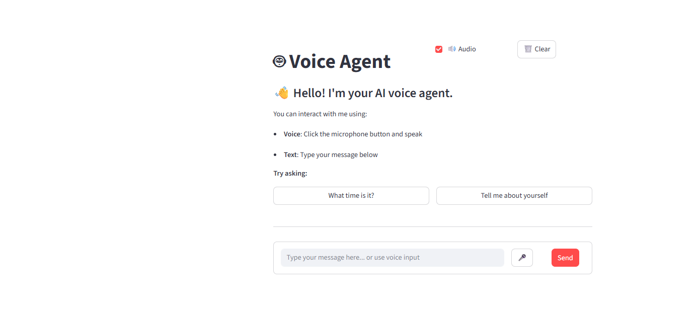
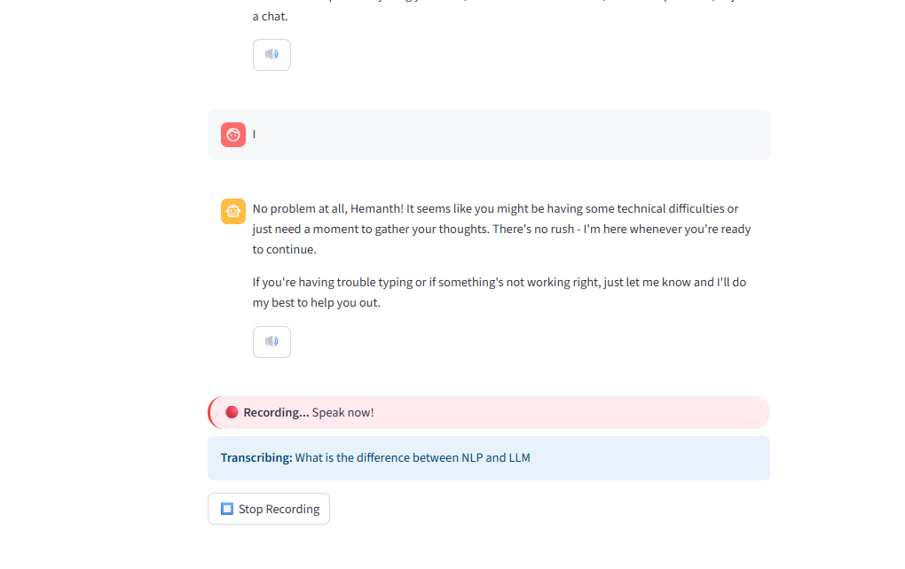
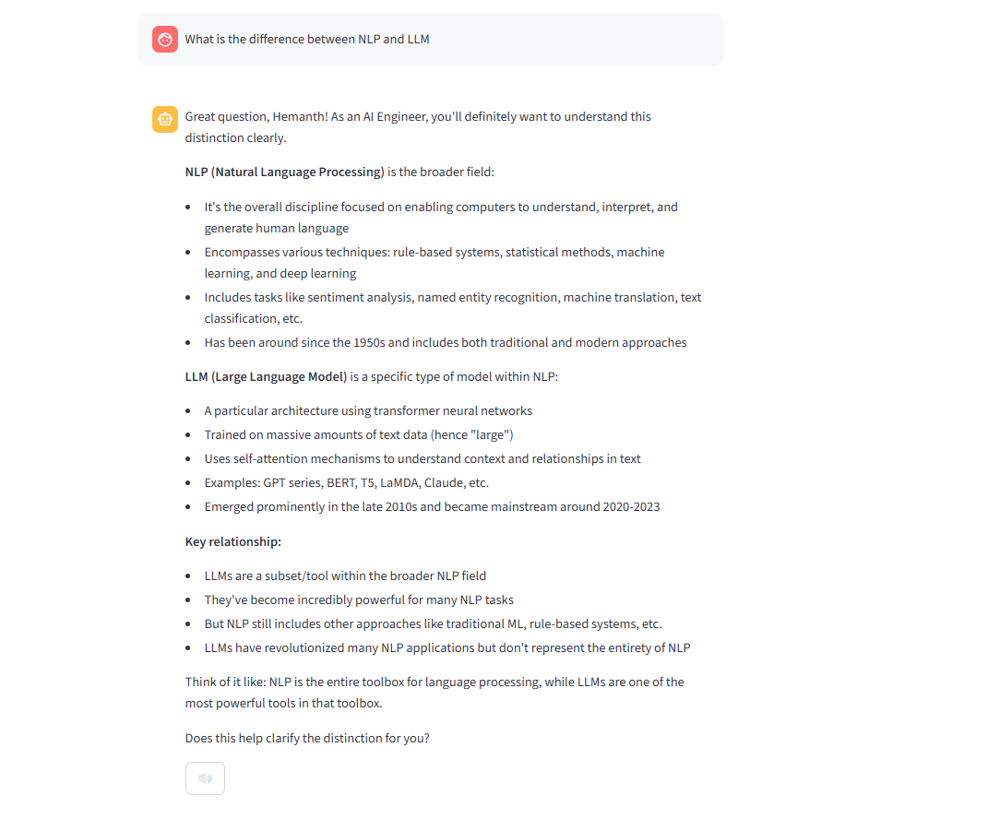
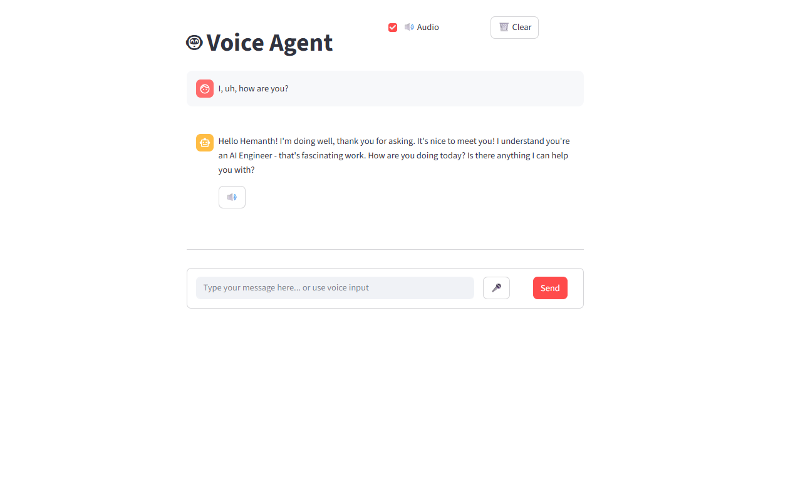

# 🎤 Voice Agent - Beginner-Friendly AI Chatbot

A **simple voice-enabled AI chatbot** perfect for beginners learning AI integration. Built with **Streamlit**, **AWS Transcribe**, **AWS Polly**, and **Strands AI Framework**.


*Simple and clean chatbot interface*

## ⚡ Why Voice Makes Everything Faster

**Traditional Text Chat**: Type → Wait → Read Response → Type Again  
**Voice Chat**: Speak → Instant Response → Listen → Speak Again  

**Result**: **3x faster** interaction and **hands-free** operation!

## 🚀 Key Features

### 🎙️ Voice Power
- **Just speak naturally** - no typing needed
- **Auto-detects** when you're done talking
- **Instant transcription** via AWS Transcribe
- **Hear responses** with natural voice


*Voice input gets processed instantly*

### 💬 Chat Interface  
- **ChatGPT-style** conversation flow
- **Switch between** voice and text anytime
- **Conversation memory** keeps context

### 🤖 Smart AI
- **Powered by Strands** AI framework
- **AWS Bedrock** language models
- **Custom tools** (time, weather, etc.)


*Smart AI processing for better responses*

## 🔄 How It Works

```
You Speak → AWS Transcribe → AI Agent → AWS Polly → You Hear
    ↑                                                    ↓
    └────────────── Instant Conversation ──────────────┘
```


*Complete voice-to-voice workflow in seconds*

## 📋 What You Need

### 🖥️ Basic Setup
- **Python 3.9+** installed
- **Microphone** and **speakers**
- **AWS account** (free tier works!)

### ⚙️ Quick Requirements
- Internet connection for AWS services
- Basic command line knowledge

## 🚀 Quick Start (5 Minutes!)

### 1. Download & Setup
```bash
# Get the code
git clone <repository-url>
cd voice_agent

# Setup Python environment
python -m venv venv
venv\Scripts\activate  # Windows
pip install -r requirements.txt
```

### 2. AWS Setup (One Time)
```bash
# Configure AWS (enter your keys when prompted)
aws configure
```
**Need AWS keys?** → Go to AWS Console → IAM → Create Access Key

### 3. Run the App
```bash
streamlit run chatbot_app.py
```
**That's it!** Open `http://localhost:8501` in your browser.

## 🎯 How to Use

### 🗣️ Voice Mode (Fastest!)
1. Click **"🎤 Start Recording"**
2. **Speak naturally**
3. Get **instant AI response** + audio
4. **Continue conversation**

### ⌨️ Text Mode (Traditional)
1. **Type** your message
2. **Hit Enter**
3. **Read response** or click 🔊 to hear it

### 🎮 Different Interfaces
```bash
streamlit run chatbot_app.py     # Main chat interface # Advanced voice features
python main.py                   # Command line version
```


### Change Voice
```python
# In polly.py - pick your favorite voice!
voice_id = "Joanna"    # Female US
voice_id = "Matthew"   # Male US  
voice_id = "Emma"      # British
```

### Adjust AI Personality
```python
# In agent.py
system_prompt = "You are a helpful coding assistant"
```

### Language Settings
```python
# In transcribe.py
LANGUAGE_CODE = "en-US"  # Or "es-ES", "fr-FR", etc.
```

## 🛠️ What's Under the Hood

### 🧠 Simple Architecture
- **Streamlit** → Pretty web interface
- **AWS Transcribe** → Converts speech to text
- **Strands AI** → Smart responses
- **AWS Polly** → Converts text back to speech

### ⚡ Why This Stack?
- **Beginner-friendly** - Easy to understand and modify
- **Cloud-powered** - No heavy local AI models needed
- **Production-ready** - AWS handles the heavy lifting
- **Cost-effective** - Pay only for what you use

## 🔧 Quick Fixes

### 😵 Not Working?
1. **No microphone?** → Check browser permissions
2. **AWS errors?** → Run `aws configure` again
3. **No sound?** → Check speakers/headphones
4. **Slow responses?** → Check internet connection

### 🚀 Make It Faster
```python
# In transcribe.py - smaller chunks = faster response
CHUNK_MS = 10  # Default is 20
```

## 🎨 Add Your Own Features

### New AI Tools
```python
# In tools.py - add any function!
def get_weather(location: str) -> str:
    return f"Weather in {location}: Sunny, 75°F"

# In agent.py - make it available
tools=[get_time, get_weather]
```

### 💡 Ideas to Try
- **Weather tool** - Get current weather
- **Calendar integration** - Check your schedule  
- **Code helper** - Explain programming concepts
- **Language tutor** - Practice conversations
- **Math solver** - Calculate complex problems

## 🌐 Share Your Project

### Run Locally
```bash
streamlit run chatbot_app.py --server.port 8501
```

### Deploy Online (Free!)
1. **Push to GitHub**
2. **Connect to Streamlit Cloud** 
3. **Auto-deploy** - that's it!

## 📚 Learn More

### Key Functions
- `agent(text)` → Get AI response
- `transcribe(audio)` → Speech to text  
- `polly(text)` → Text to speech

### Next Steps
- **Add more tools** to your agent
- **Customize the UI** with your style
- **Deploy** and share with friends!

## 🚀 Perfect for Beginners Because:

- **No complex setup** - Just 3 commands to start
- **Learn by doing** - See AI, voice, and web tech working together  
- **Extend easily** - Add new features step by step
- **Real-world ready** - Uses industry-standard AWS services


**Made with ❤️ by Hemanth - AI Engineer**

*Voice Agent - Your first step into conversational AI*